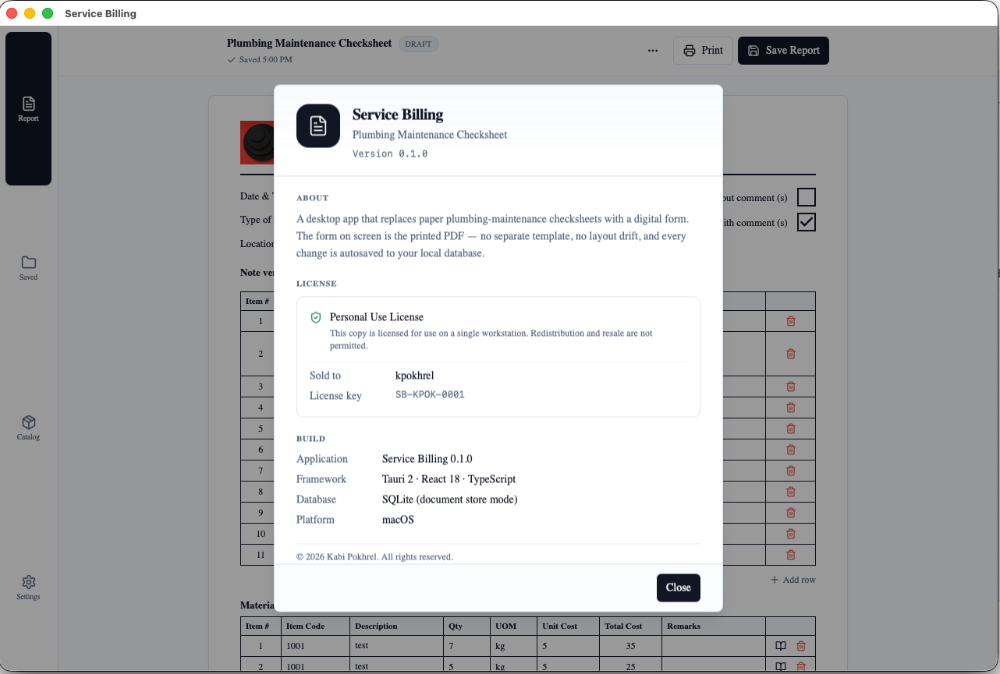

# Service Billing — Releases

Official distribution channel for **Service Billing**, a desktop app that
replaces paper plumbing-maintenance checksheets with a digital form. Every
change is autosaved locally, and the form on screen is exactly what gets
printed (or saved as PDF) — no separate template, no layout drift.

---

## ⬇️ Download

**Latest Windows installer:** [Releases → latest](https://github.com/kabinpokhrel/service-billing-releases/releases/latest)

Click `service-billing_X.Y.Z_x64-setup.exe` under "Assets" (~2 MB).

---

## 🖥 System requirements

- **Windows 10 (build 1803 or newer) or Windows 11**, x64 architecture
- **WebView2 Runtime** — pre-installed on all modern Windows; older builds
  will be prompted to install it on first launch
- ~100 MB of disk for the app + database

---

## 📦 Installation

1. Download the `.exe` from the latest release
2. Double-click to run
3. **Windows SmartScreen warning is expected** — the installer isn't signed
   with a commercial code-signing certificate yet. Click "More info" →
   "Run anyway". This is a one-time warning per version.
4. Installer completes in seconds — no admin password needed
5. App appears in your Start menu under "Service Billing"

> 💾 **Data location:** `%APPDATA%\com.kabipokhrel.servicebilling\appdata.db`
> All reports, catalog items, and settings live in this single SQLite file.
> The app's **Settings → Database → Backup database** action creates a
> safe snapshot you can copy off-machine. Keep at least one external
> backup of important work.

---

## ✨ Features

- 📝 **Plumbing checksheet** with pre-seeded standard maintenance items;
  add or edit rows freely
- 🧾 **Materials catalog** with inline autocomplete in the form
- ✍️ **Multi-signatory rows** — Attended By, Foreman, Supervisor, Engineer,
  with multiple signers per role
- ✅ **Three-stage lifecycle** — Draft → Completed → Signed (locked)
- 🖨 **Print or save as PDF** directly from the toolbar; the on-screen form
  IS the printed form (no layout differences)
- 💾 **Autosave every keystroke** — drafts survive crashes and forced shutdowns
- 🔍 **Saved reports** with search, sort, pagination, and status filter
- 🎨 **Customise** fonts, sizes, date format, and page zoom from Settings
- 🔄 **Auto-update** built in — Settings → Updates → Check for updates,
  or notification on launch
- 🌍 **Native menu bar** with platform-appropriate shortcuts (Ctrl+S, Ctrl+P, etc.)

---

## 🔄 Updates

The app checks for new releases automatically on launch. When an update is
available you'll see "Update available — vX.Y.Z" in the top bar — install
via **Settings → Updates → Check for updates → Download & install**.

Every installer is **cryptographically signed** with a private key. The
installed app verifies the signature against a public key baked into the
binary, so only genuine releases from this repo will install.

---

## 🔒 Privacy

All data stays on your machine. The only network calls the app makes are:

- **Update checks** on launch — fetches a small JSON manifest from this
  GitHub repo to see if a newer version exists. **No personal data is sent.**

No telemetry, no analytics, no phone-home of any kind.

---

## ❓ Support

- **Bug reports / feature requests:** contact the developer directly
  (Kabi Pokhrel)
- **Source code:** [kabinpokhrel/ServiceBillingApp](https://github.com/kabinpokhrel/ServiceBillingApp) (private)

---

## 📜 License

Personal Use License — see the **About** dialog inside the app for the
license key and your registered name.

Built with [Tauri 2](https://tauri.app) · [React 18](https://react.dev) · [SQLite](https://www.sqlite.org/).

---

*This repo only hosts release artifacts. Do not commit code or files here
manually — it's auto-populated by CI from the [source repo](https://github.com/kabinpokhrel/ServiceBillingApp).*